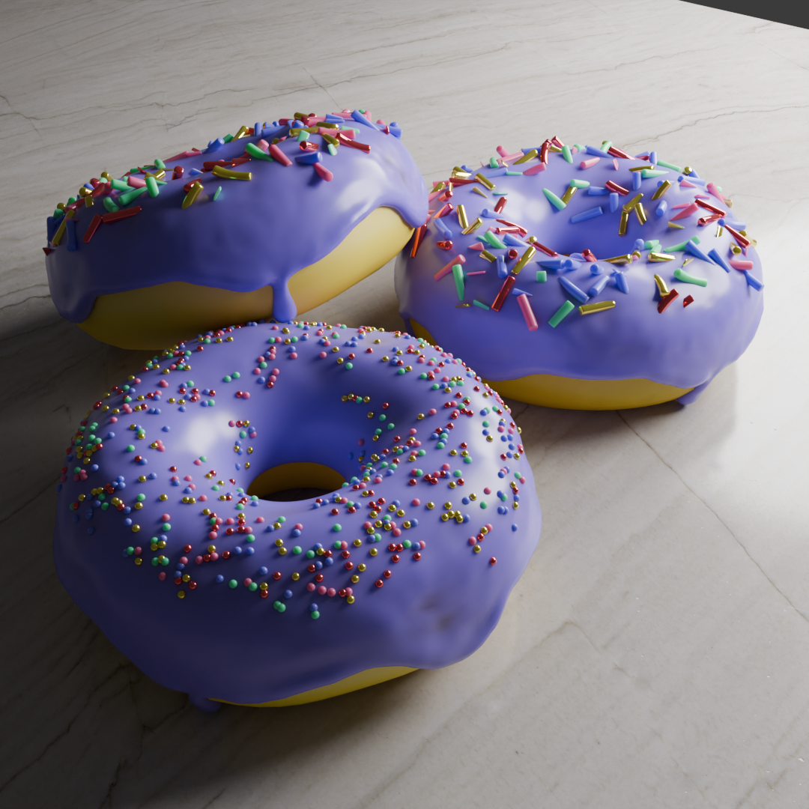

# Donut in Blender

This Donut was created by following the Youtube tutorial of [Blender Guru](https://www.youtube.com/playlist?list=PLjEaoINr3zgEPv5y--4MKpciLaoQYZB1Z).

This was used to brush up my Blender skills from my Last VR project in Unity and Blender.

The following images show the progress made throughout the journey.

The final render was made using **Ray tracing** in cycles (took around 5 mins in 3050Ti):

 

### Course structure

Covered:
1. Basic navigation of the GUI
2. Basic modelling
3. Shaping
4. Sculpting
5. Shading
6. Geometry Nodes
7. Rendering using Ray tracing